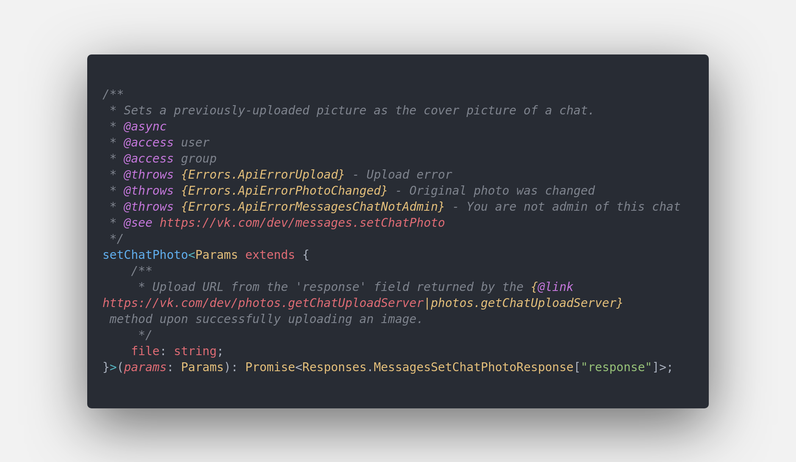
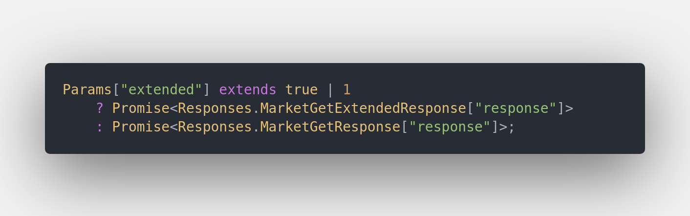

# Schema

Данный пакет предназначен для типизации API ВКонтакте основываясь на
их [JSON Scheme](https://github.com/VKCOM/vk-api-schema).

## Что предлагает данная типизация

1. Документация на всё и вся, прямо от вк
2. Расширенный JSDoc для методов
   
3. Полная поддержка расширенных ответов за счёт использования последних фич typescript'а
   

Так-же пакет экспортирует список ошибок API и определённые костыли для работы других компонентов VK DK (api).

### Костыли:

`Methods._exportedDomains` - Список доменов API ВКонтакте, описанные в схеме.  
`Methods._domainsSpecifier` - По-факту пустой класс, предназначенный для репрезентации API, который потом реализуется в `@vk-dk/api`
